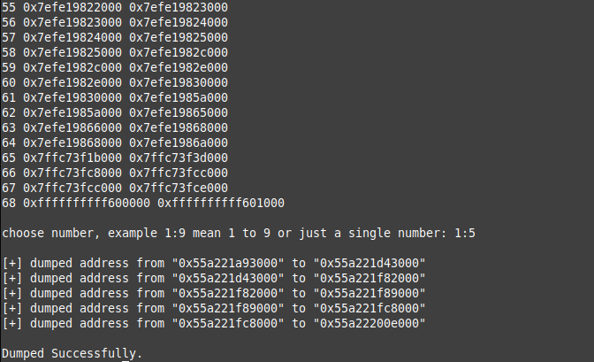

# memdumper
simple memory dumper tool for linux



# Usage:

```bash
./memdumper <pid>
```

This script uses `/proc/pid/maps` to detect memory addresses and will dump them using the `GDB` debugger.

### Download Latest [Release](https://github.com/aDarkDev/memdumper/releases)
